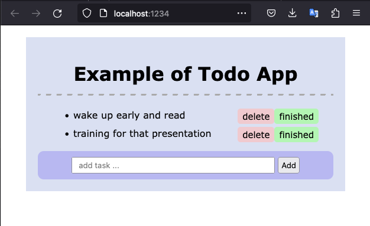

# TINY WEB

Studying typescript by implementing a tiny web framework from scratch.

### Getting started

<!--  -->

1. **`$ npm run start`**

2. Go to app at [http://localhost:1234](http://localhost:1234)

3. Play around todo features

### How it works?

- This is based on old way of handling web pages interaction.
- Based on things like backbonejs and marionettejs

### Features

- Event based communication (pub/sub)
- Syncing system to save/fecth data from DB
- Generic Model / Collection to define your own
- Generic View / Collection to render something on page

### Built With

- [Parcel](https://www.parceljs.org)  - Zero configuration build tool for web
- [json-server](https://github.com/typicode/json-server)  -  Local REST API to test out things

### Author

- **Marcio Mendes** - [mmendesas](https://github.com/mmendesas)

### License

This project is licensed under the MIT License
